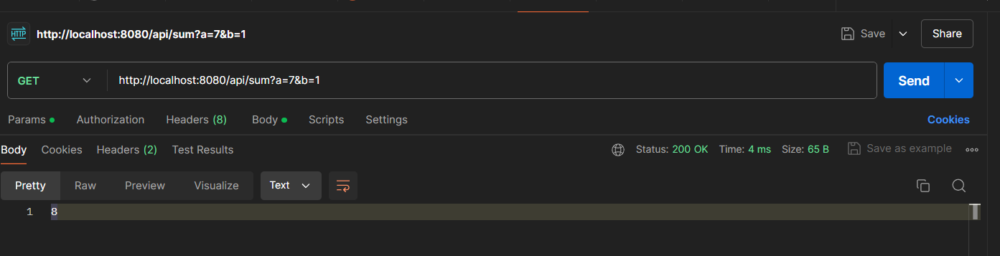
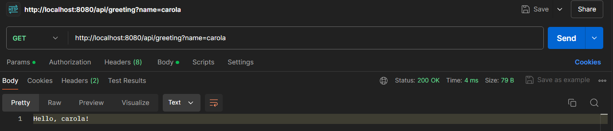
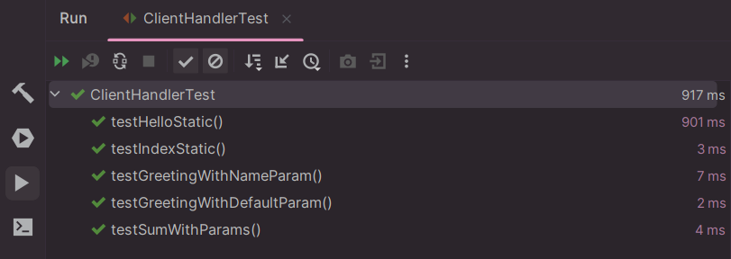

# TALLER DE ARQUITECTURAS DE SERVIDORES DE APLICACIONES, META PROTOCOLOS DE OBJETOS, PATRÓN IOC, REFLEXIÓN


Este proyecto implementa un servidor web en Java que maneja solicitudes HTTP para servicios REST y archivos estáticos. Utiliza arquitecturas de servidores de aplicaciones y reflexión para descubrir métodos y controlar el flujo de ejecución en tiempo real. Además, implementa el patrón IoC para la gestión de dependencias y el ciclo de vida de los objetos, aprovechando meta protocolos de objetos para estructurar la lógica de la aplicación.

## Arquitectura
Este proyecto sigue la arquitectura cliente-servidor. La arquitectura maneja solicitudes HTTP, dirigiéndolas al componente adecuado para su procesamiento y devolviendo una respuesta al cliente.

### componentes


- **Cliente** : Envía una solicitud HTTP al servidor.

- **Conexión de Socket**: La solicitud es recibida por el servidor a través de una conexión de socket.

- **ClientHandler**: Se encarga de manejar la conexión del cliente y procesar la solicitud HTTP.

- **Framework SpringECI**: El ClientHandler pasa la solicitud al núcleo del framework SpringECI. 

- **Manejo Dinámico de Solicitudes**: El framework determina cómo manejar la solicitud, ya sea dirigiéndola a un controlador o al manejo de archivos estáticos.

- **Controladores**: Si la solicitud corresponde a una ruta manejada por un controlador (como GreetingController o SumController), el controlador procesa la solicitud según el método mapeado.

- **Manejo de Archivos Estáticos**: Si la solicitud es para un archivo estático (como una imagen o HTML), el framework lo busca en el sistema de archivos (webroot) y lo sirve al cliente.

- **Sistema de Archivos carpeta weebroot**: Almacena los archivos estáticos que el servidor puede servir.

- **Anotaciones**: Se utilizan para mapear las solicitudes a los métodos de los controladores específicos (como RequestParam, GetMapping etc.).

- **Respuesta**: La respuesta generada (ya sea desde un controlador o desde el manejo de archivos estáticos) se envía de vuelta al ClientHandler.

- **Cliente**: Finalmente, la respuesta regresa al cliente que hizo la solicitud.

## Empezando

### Requisitos Previos
Para ejecutar este proyecto, necesitarás tener instalado:

- Java JDK 17.
- Un IDE de Java como IntelliJ IDEA, Eclipse, o NetBeans.
- Maven para manejar las dependencias
- Un navegador web para interactuar con el servidor.

### Instalación

1. Tener instalado Git en tu maquina local
2. Elegir una carpeta en donde guardes tu proyecto
3. abrir la terminal de GIT --> mediante el clik derecho seleccionas Git bash here
4. Clona el repositorio en tu máquina local:
   ```bash
   git clone https://github.com/Medina95/Taller2-AREM.git
   ```
## Deployment
1. Abre el proyecto con tu IDE favorito o navega hasta el directorio del proyecto
2. Desde la terminal  para compilar el proyecto ejecuta:

   ```bash
   mvn clean install
   ```
3. Compila el proyecto  que contiene el metodo MAIN: SpringECI.java o ejecuta desde la terminal

   ```bash
    java -cp target/classes edu.escuelaing.arem.ASE.app.SpringECI

   ```
   Vera que el servidor esta listo y corriendo sobre el puerto 8080

4. Puedes interactuar con los endpoints RESTful (/api) con:
    - http://localhost:8080/api/sum?a=7&b=1
    - http://localhost:8080/api/pi
    - http://localhost:8080/api/greeting
    - http://localhost:8080/api/greeting?name=carola
    - http://localhost:8080/api/hello
    - http://localhost:8080/api/adios
    - http://localhost:8080/api/sumade1mas2
    - http://localhost:8080/index.html




## Ejecutar las pruebas

El proyecto incluye pruebas unitarias que simulan solicitudes HTTP, verificando que los controladores y el manejo de archivos estáticos funcionen correctamente. Se utilizan herramientas como Mockito para simular conexiones y flujos de entrada/salida.
Para ejecutar las pruebas:
1. Desde tu IDE, ejecuta la clase AppTest.java o desde la terminal ejecutas:
   ```bash
   mvn test
   ```
### Desglosar en pruebas de extremo a extremo
Cada prueba utiliza el método testEndpoint que simula una solicitud HTTP, ejecuta el método del ClientHandler, y verifica si la respuesta coincide con el contenido y estado esperado. Este recibe un **httpRequest** la solicitud HTTP a simular
**expectedContent** el contenido esperado en la respuesta, **expectedStatus**  el estado esperado en la respuesta

- **testGreetingWithNameParam**: Prueba el servicio de saludo con un parámetro de nombre. Configura el servicio REST para la ruta "/greeting" con un parámetro de nombre, simula una solicitud y verifica si la respuesta es correcta.
- **testIndexStatic**: Prueba el servicio de contenido estático para la ruta raíz "/". Configura el servicio REST para la ruta "/", simula una solicitud y verifica si la respuesta contiene el contenido esperado.
- **testHelloStatic**: Prueba el servicio de contenido estático para la ruta raíz "/hello". Configura el servicio REST para la ruta "/", simula una solicitud y verifica si la respuesta contiene el contenido esperado.
- **testSumWithParams**:Prueba el servicio de suma con parámetros. Configura el servicio REST para la ruta "/sum" con parámetros de suma, simula una solicitud y verifica si la respuesta es el resultado correcto de la suma.
- **testGreetingWithDefaultParam**: Prueba el servicio de saludo con el parámetro de nombre por defecto. Configura el servicio REST para la ruta "/greeting" sin parámetros, simula una solicitud y verifica si la respuesta es el saludo por defecto.

### Ejemplo
 ```bash
        @Test
        public void testGreetingWithNameParam() throws Exception {
        Method greetingMethod = GreetingController.class.getMethod("greeting", String.class);
        SpringECI.services.put("/greeting", greetingMethod);
        String httpRequest = "GET /api/greeting?name=CAROLA HTTP/1.1\r\n";
        String expectedContent = "Hello, CAROLA!";
        String expectedStatus = "HTTP/1.1 200 OK";
        testEndpoint(httpRequest, expectedContent, expectedStatus);
    }
      
   ```


## Built With
* [Maven](https://maven.apache.org/) - Dependency Management


## Authors

* **Carolina Medina Acero** -  [Medina95](https://github.com/Medina95)
